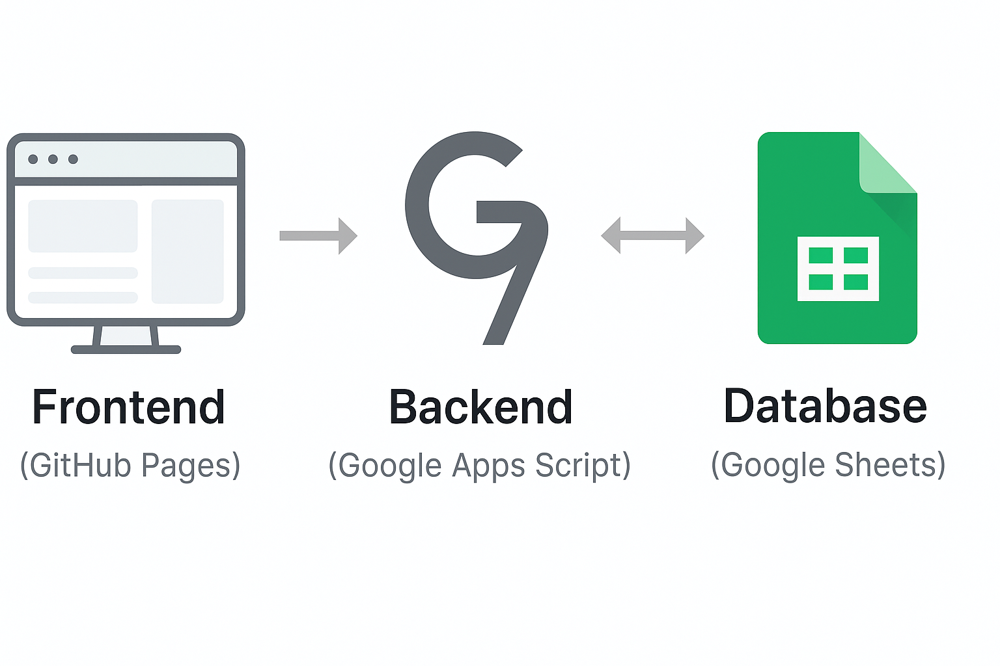

# After-School Attendance System  
_A lightweight attendance and enrollment management system powered by Google Apps Script and Google Sheets._

基于 **Google Apps Script** 与 **Google Sheets** 的轻量级学生报名与考勤管理系统，  
专为课后教育机构或小型班级设计，重点在于：**隐私安全、部署简便、移动端友好、低成本维护**。  

_Last updated: 2025-10-20_

---

## 🧭 1. Project Overview / 项目概述  

This system manages student enrollment, class scheduling, and attendance tracking.  
It connects a static web frontend (HTML/JS) hosted on **GitHub Pages** to a backend built on **Google Apps Script**,  
which in turn reads and writes data from **Google Sheets**.  

系统用于学生报名、课程安排及出勤记录。  
前端（HTML/JS）托管在 **GitHub Pages**，后端使用 **Google Apps Script** 作为逻辑处理层，  
并以 **Google Sheets** 作为数据存储。  

---

## 🖼️ 2. System Overview / 系统示意图  

<p align="center">
  
</p>

> *Figure 1.* System workflow: GitHub Pages frontend → Apps Script backend → Google Sheets data storage.

---

## ⚙️ 3. System Architecture / 系统架构与外围工具说明  

### Architecture Overview  
```
[Frontend: GitHub Pages]
      ↓  (HTTPS requests via fetch)
[Backend: Google Apps Script (doGet/doPost)]
      ↓  (Data read/write)
[Database: Google Sheets]
```

**Frontend (GitHub Pages)**  
- Static web pages written in HTML/CSS/JavaScript.  
- Handles user interaction, form input, and API calls.  

**Backend (Google Apps Script)**  
- Exposes REST-like endpoints (`doGet`, `doPost`).  
- Executes logic based on `action` parameters (e.g., `getStudentsByClass`).  
- Validates and updates data in Google Sheets.  

**Database (Google Sheets)**  
- Stores student, course, and attendance data.  
- Serves as the system’s “data warehouse.”  

**Interconnection:**  
All pages communicate with Apps Script via a centralized `API_URL` defined in `config.js`.  
Each front-end request sends parameters through `fetch()` → Apps Script → writes/reads Sheets → returns JSON to front-end.

---

## 🗂️ 4. File Structure / 文件结构  

```
📦 AfterSchoolAttendance/
 ┣ 📄 index.html
 ┣ 📄 Login.html
 ┣ 📄 StudentEnrollment.html
 ┣ 📄 CourseEnrollment.html
 ┣ 📄 StudentCourseApplication.html
 ┣ 📄 Attendance.html
 ┣ 📄 style.css
 ┣ 📄 config.js
 ┣ 📁 icons/
 ┗ 📁 docs/
    ┗ 📄 system-architecture.png
```

---

## 🧩 5. Main Features / 主要功能模块  

### 🧱 Login.html  
Email OTP login interface for secure access.  
通过电子邮件一次性验证码（OTP）实现用户登录验证。  
**Key Points:**  
- Google Apps Script sends OTP via Gmail API.  
- OTP verified through Sheet lookup.  
- Session timeout control under development.  

---

### 🧾 StudentEnrollment.html  
Student registration and search interface.  
学生注册与查询页面。  
**Key Points:**  
- Data stored in `Student-List` sheet.  
- Supports form input validation and duplicate checking.  
- Search students by name or guardian info.  

---

### 📚 CourseEnrollment.html  
Course creation and management.  
课程创建与管理模块。  
**Key Points:**  
- Course info stored in `Course-List` sheet.  
- Each course tagged with `dayOfWeek` for scheduling.  
- Supports active/inactive status toggle.  

---

### 🧠 StudentCourseApplication.html  
Assign students to courses.  
学生报名课程模块。  
**Key Points:**  
- Displays student search result list with radio-style selection.  
- Shows available courses grouped by `dayOfWeek`.  
- Each day supports single course selection.  
- Data written to `Student-Class-Details` sheet.  

---

### 🕒 Attendance.html  
Daily attendance management interface.  
学生出勤管理页面。  
**Key Points:**  
- Loads active classes via Apps Script (`getActiveClasses`).  
- Displays students by selected class (`getStudentsByClass`).  
- Supports Present / Absent / Leave status switching.  
- `Submit Attendance` writes attendance record to `AttendanceRecords` sheet.  
- Day-of-week validation prevents accidental wrong-day marking.  
- UI designed for mobile and tablet use (responsive grid layout).  

---

## 🧰 6. Shared Components / 公共组件  

### ⚙️ config.js  
Global configuration and utility functions.  
全局配置与工具函数。  
**Contains:**  
- `API_URL` – Backend endpoint for Apps Script.  
- `showNotification()` – Global notification function.  
- Common logic for POST/GET operations.

---

### 🎨 style.css  
Defines the system’s visual identity and responsive layout.  
系统统一的样式与响应式设计。  
**Highlights:**  
- Modular color variables for consistency.  
- Mobile-first layout design.  
- Card-based UI components for students, courses, and attendance records.  

---

## 🔗 7. Apps Script API Logic / Apps Script 接口逻辑  

**Main Functions:**
| Function | Description |
|-----------|-------------|
| `doGet(e)` | Handles data retrieval via URL parameters. |
| `doPost(e)` | Handles data submission from frontend forms. |
| `getActiveClasses` | Returns all active courses grouped by weekday. |
| `getStudentsByClass` | Fetches students assigned to a specific class. |
| `submitAttendance` | Writes attendance data to `AttendanceRecords`. |

**Data Flow Example:**  
1️⃣ Frontend JS sends request via `fetch(API_URL + "?action=getStudentsByClass&className=...")`  
2️⃣ Apps Script parses `e.parameter.action`  
3️⃣ Apps Script reads from `Student-Class-Details` & `Student-List`  
4️⃣ Returns JSON response to frontend for rendering  

---

## 💡 8. Design Philosophy / 设计理念  

- **Data-Driven Logic**：All UI components rely on Google Sheet data.  
- **Privacy-Focused**：No third-party login; data remains in owner’s Google account.  
- **Low Maintenance**：Apps Script auto-runs in Google’s cloud, zero hosting cost.  
- **Modular Development**：Each HTML is independent but shares config.js.  
- **Consistent Visual Language**：Color-coded modules and unified UI across pages.  

---

## 🚀 9. Next Phase Plan / 下一阶段计划  

1. **Session Control** – Auto-expiry login token (1h).  
2. **Report.html** – Statistical analysis of student and class data.  
3. **Enhanced Notification System** – Dual-container notifications for Attendance page.  
4. **Voice Note Integration** – Record leave notes via audio upload.  
5. **Admin Dashboard** – Manage users, classes, and attendance summaries.  

---

## 🕓 10. Change History / 更新记录  

- 2025-10-20：Added full bilingual README with architecture diagram, tool explanations, and key modules.  
- 2025-10-19：Completed Attendance.html v2 with dropdown class selection and dayOfWeek validation.  
- 2025-10-16：Integrated OTP email login flow.  
- 2025-10-10：Established Apps Script API (getActiveClasses / submitAttendance).  
- 2025-10-07：Added shared config.js and style.css; unified color theming.  
- 2025-09：Initial project setup and GitHub Pages deployment.  

---

_This project is part of the “Monica & Linan” education toolkit — designed for simplicity, security, and collaboration._  
